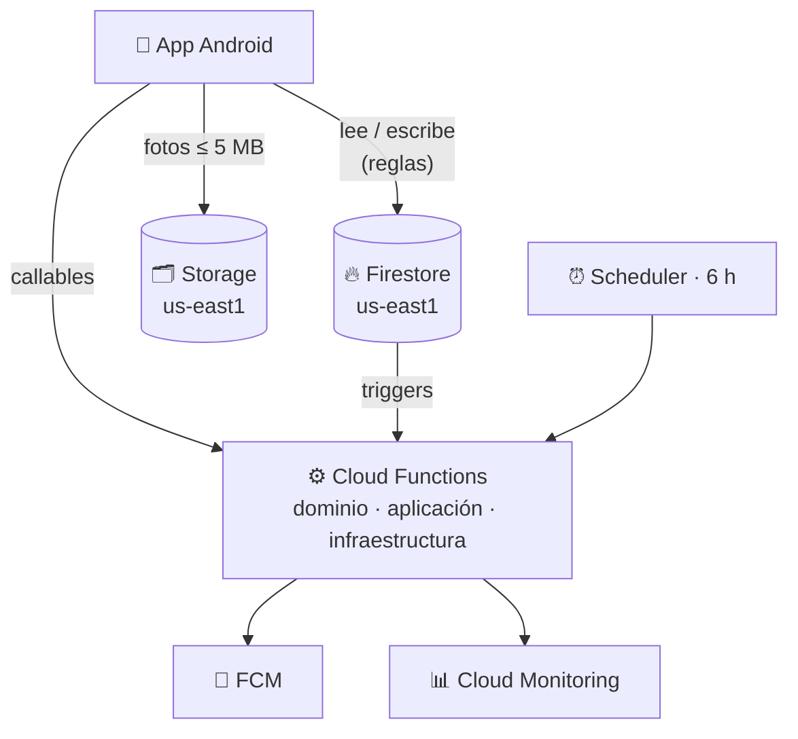

<div align="center">

# ☁️ Control Tienda · Backend

**Backend serverless en Firebase para la app [Control Tienda](https://github.com/L-FER-GT/control_tienda_front).**
Reglas de seguridad por rol, Cloud Functions, superadmin y alertas de consumo al 80 % de la cuota gratuita.

[](https://github.com/L-FER-GT/control_tienda_backend/actions/workflows/ci.yml)
[](https://github.com/L-FER-GT/control_tienda_backend/actions/workflows/deploy.yml)


[Qué incluye](#-qué-incluye) ·
[Arquitectura](#-arquitectura) ·
[Inicio rápido](#-inicio-rápido) ·
[Consumo y alertas](#-consumo-y-alertas) ·
[Documentación](#-documentación)

</div>

---

## 📦 Qué incluye

| | |
|---|---|
| 🔐 **Reglas de seguridad** | Roles por tienda (administrador, empleado, cliente), permisos delegados, tiendas públicas/privadas, superadmin. |
| 🗂️ **Índices** | Consultas de ventas por vendedor, invitaciones pendientes y membresías (collection group). |
| 🖼️ **Storage** | "Carpeta del servidor" con límite de **5 MB** por archivo; Firestore guarda solo la ruta. |
| 🔢 **Código de usuario** | Cada usuario recibe un código único de 10 dígitos para ser invitado. |
| ✉️ **Invitaciones** | Notificación en la app + push; aceptar crea la membresía en una transacción. |
| 🧾 **Ventas offline** | Las órdenes llegan sin número; el servidor asigna el correlativo y descuenta stock (idempotente). |
| 🚚 **Recepciones** | Suman stock aplicando solo la diferencia al editar, actualizan el costo y su historial. |
| 🧹 **Limpieza** | Borra de Storage las fotos reemplazadas. |
| 🛡️ **Superadmin** | Usuario maestro definido en `.env`; ve el consumo y deshabilita usuarios o tiendas. |
| 📊 **Consumo al 80 %** | Panel en la app, aviso push cada 6 h y alertas por correo de Cloud Monitoring. |

## 🏛️ Arquitectura



Las Cloud Functions siguen arquitectura **hexagonal**: reglas puras en `domain/`, casos de uso y
puertos en `application/`, adaptadores de Firebase en `infrastructure/` y puntos de entrada
(callables, triggers, tareas programadas) en `entrypoints/`.
Detalle en [docs/01-arquitectura.md](docs/01-arquitectura.md).

## 🚀 Inicio rápido

Requisitos: **Node 22.12+** y **Java 21** (para los emuladores).

```bash
git clone https://github.com/L-FER-GT/control_tienda_backend.git
cd control_tienda_backend
npm install                      # instala también functions/
npm run emulators                # Auth, Firestore, Storage y Functions en local
npm run superadmin:seed:emulator # (otra terminal) crea el superadmin de prueba
```

Panel del emulador: <http://localhost:4000>

```bash
npm test                         # unitarias + reglas + integración
npm run deploy                   # producción (alias "prod" en .firebaserc)
```

## 📊 Consumo y alertas

| Recurso | Cuota gratuita | Alerta (80 %) |
|---|---|---|
| Lecturas Firestore | 50 000 / día | 40 000 |
| Escrituras Firestore | 20 000 / día | 16 000 |
| Borrados Firestore | 20 000 / día | 16 000 |
| Fotos guardadas | 5 GB | 4 GB |
| Descarga de fotos | 100 GB / mes | 80 GB |
| Ejecuciones de funciones | 2 M / mes | 1,6 M |

Tres capas: panel en **Opciones maestras** de la app, alertas por correo con
`npm run monitoring:setup` y un **presupuesto** de facturación. Ver
[docs/03-plan-blaze-cuotas-y-alertas.md](docs/03-plan-blaze-cuotas-y-alertas.md).

## 🗂️ Estructura

```
control_tienda_backend/
├── firestore.rules            Reglas de Firestore
├── firestore.indexes.json     Índices
├── storage.rules              Reglas de Storage (5 MB)
├── functions/                 Cloud Functions (TypeScript)
│   ├── src/domain/            Reglas puras
│   ├── src/application/       Casos de uso y puertos
│   ├── src/infrastructure/    Adaptadores de Firebase
│   ├── src/entrypoints/       Callables, triggers y tareas programadas
│   └── test/                  Unitarias e integración
├── scripts/                   Superadmin y alertas de Cloud Monitoring
├── tests/rules/               Pruebas de reglas con el emulador
├── docs/                      Guías paso a paso
└── .env.example               Plantilla de credenciales locales
```

## 📚 Documentación

| Guía | Contenido |
|---|---|
| [01 · Arquitectura](docs/01-arquitectura.md) | Servicios, capas y lista de funciones |
| [02 · Crear el proyecto Firebase](docs/02-crear-proyecto-firebase.md) | Blaze, Firestore, Storage, Auth, primer deploy |
| [03 · Plan Blaze, cuotas y alertas](docs/03-plan-blaze-cuotas-y-alertas.md) | Cuotas gratuitas, alertas al 80 % y presupuesto |
| [04 · Superadmin](docs/04-superadmin.md) | Usuario maestro desde `.env` y opciones maestras |
| [05 · Emuladores y pruebas](docs/05-emuladores-y-pruebas.md) | Desarrollo local y suites de pruebas |
| [06 · Despliegue y CI/CD](docs/06-despliegue-y-ci-cd.md) | GitHub Actions, cuenta de servicio, environments |
| [07 · Credenciales](docs/07-credenciales.md) | Qué es cada credencial, dónde se obtiene y dónde se guarda |
| [08 · Modelo de datos](docs/08-modelo-de-datos.md) | Colecciones, campos y rutas de Storage |
| [09 · Reglas de seguridad](docs/09-reglas-de-seguridad.md) | Matriz de permisos por rol |

## 🌿 Ramas

| Rama | Uso |
|---|---|
| `master` | **Producción**: despliegue automático a Firebase |
| `develop` | Integración: solo pruebas |
| `feature/*` | Desarrollo: pruebas en cada push |

---

<div align="center">
Parte del proyecto <b>Control Tienda</b> · Uso interno
</div>
