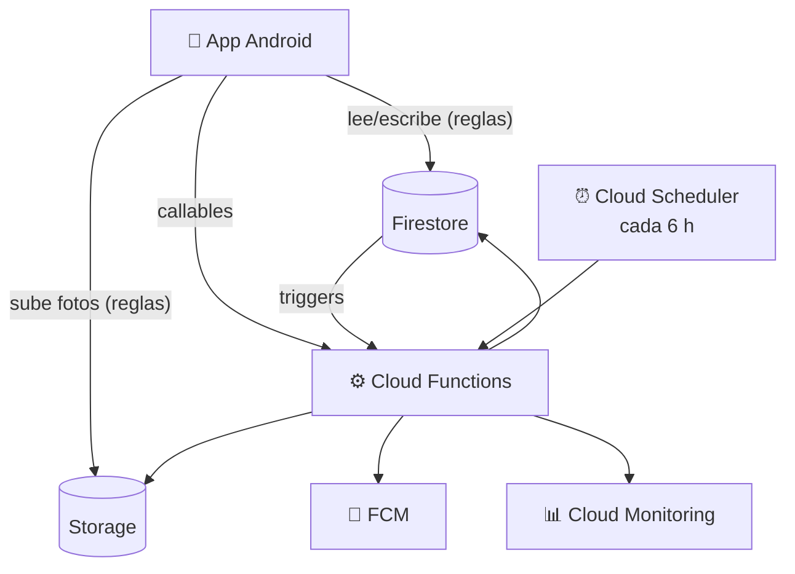

# 1. Arquitectura del backend

El backend es **100 % Firebase** (sin servidores propios):

| Pieza | Servicio | Rol |
|---|---|---|
| Base de datos en la nube | Cloud Firestore (`us-east1`) | Tiendas, catálogo, ventas, compras, notificaciones |
| "Carpeta del servidor" | Cloud Storage (`us-east1`) | Fotos y facturas (máx. 5 MB). Firestore guarda solo la ruta |
| Login | Firebase Authentication | Correo/contraseña y Google |
| Lógica de servidor | Cloud Functions 2ª gen. (`us-east1`, Node 22) | Código de usuario, invitaciones, números de orden, stock, limpieza, consumo |
| Notificaciones push | Firebase Cloud Messaging | Invitaciones, respuestas y alertas de consumo |
| Tiempo real y offline | Listeners + caché persistente de Firestore (en la app) | "Sala" de cada tienda y base local |
| Consumo | Cloud Monitoring | Opciones maestras y alertas al 80 % |



## Capas de las Cloud Functions (hexagonal)

```
functions/src
├── domain/          Reglas puras y testeables
│   ├── userCode.ts      código único de 10 dígitos
│   ├── quotas.ts        cuotas gratuitas, umbral 80 %, ventanas día/mes
│   ├── stock.ts         descuentos por venta, ledger de recepciones (diferencias)
│   ├── files.ts         qué archivos quedaron huérfanos
│   ├── messages.ts      textos de notificaciones
│   └── time.ts          medianoche del Pacífico (reinicio de cuotas)
├── application/     Casos de uso y puertos
│   ├── ports.ts         UsageSource, PushSender, NotificationWriter…
│   └── usage.ts         reporte de consumo y vigilante de alertas
├── infrastructure/  Adaptadores
│   ├── firebase.ts      Admin SDK
│   ├── users.ts         perfil, borrado de cuenta, deshabilitar
│   ├── invitations.ts   notificar y responder invitaciones
│   ├── inventory.ts     número de orden + stock, recepciones
│   ├── notifications.ts FCM y notificaciones en Firestore
│   └── usageSources.ts  Cloud Monitoring (real) y emulador (ejemplo)
└── entrypoints/     Adaptadores de entrada
    ├── callables.ts     bootstrapUser, respondInvitation, deleteAccount, admin*
    ├── triggers.ts      onInvitation*, onOrderCreated, onReceptionWritten, cleanup*
    └── scheduled.ts     usageWatchdog
```

## Funciones

| Función | Tipo | Qué hace |
|---|---|---|
| `bootstrapUser` | callable | Crea el perfil del usuario con su código único de 10 dígitos (idempotente) |
| `respondInvitation` | callable | El invitado acepta o rechaza; al aceptar crea la membresía (transacción) |
| `deleteAccount` | callable | Elimina la cuenta y datos personales; sus tiendas quedan deshabilitadas |
| `adminGetUsage` | callable (superadmin) | Consumo actual vs. cuotas gratuitas |
| `adminSetUserDisabled` | callable (superadmin) | Deshabilita/habilita un usuario (y revoca su sesión) |
| `adminSetStoreDisabled` | callable (superadmin) | Deshabilita/habilita una tienda |
| `onInvitationCreated` / `onInvitationUpdated` | trigger | Notificación + push al invitado; refleja cancelaciones |
| `onOrderCreated` | trigger | Asigna el correlativo de la tienda y descuenta stock (idempotente) |
| `onReceptionWritten` | trigger | Suma stock (solo la diferencia al editar/borrar), actualiza costo e historial |
| `onPublicProfileUpdated` | trigger | Actualiza nombre/foto en las membresías |
| `cleanup*Files` | trigger | Borra de Storage las fotos reemplazadas |
| `usageWatchdog` | programada (6 h) | Avisa al superadmin al 80 % de cualquier cuota |

Ver también [08-modelo-de-datos.md](08-modelo-de-datos.md) y [09-reglas-de-seguridad.md](09-reglas-de-seguridad.md).
