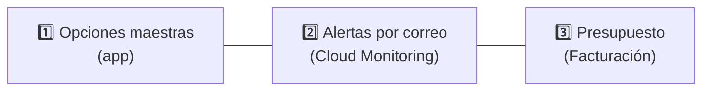

# 3. Plan Blaze: cuotas gratuitas y alertas al 80 %

El plan **Blaze** es de pago por uso, pero incluye una cuota sin costo. El objetivo es quedarse
dentro de ella y enterarse **antes** de superarla.

## Cuotas gratuitas que vigila el sistema

| Recurso | Cuota gratuita | Alerta al 80 % | Periodo |
|---|---|---|---|
| Lecturas Firestore | 50 000 | **40 000** | por día |
| Escrituras Firestore | 20 000 | **16 000** | por día |
| Borrados Firestore | 20 000 | **16 000** | por día |
| Fotos y archivos guardados (Storage) | 5 GB | **4 GB** | total |
| Descarga de fotos (Storage) | 100 GB | **80 GB** | por mes |
| Ejecuciones de Cloud Functions | 2 000 000 | **1 600 000** | por mes |

Otras cuotas relevantes (no se vigilan porque es muy difícil alcanzarlas con el uso normal):
1 GiB almacenado en Firestore, 10 GiB/mes de salida de Firestore, 5 000 operaciones de subida y
50 000 de descarga al mes en Storage, 400 000 GB-s y 200 000 CPU-s de Functions, 3 trabajos de
Cloud Scheduler. Authentication (correo y Google) y FCM son gratuitos.

> Las cuotas diarias de Firestore se reinician a medianoche hora del Pacífico (02:00–03:00 en Perú).
> El nivel gratuito de Storage solo aplica a buckets en `us-east1`, `us-central1` o `us-west1`.
> Revisa los valores vigentes en <https://firebase.google.com/pricing>; si cambian, actualiza
> `functions/src/domain/quotas.ts` y `scripts/setup-monitoring-alerts.ts`.

## Las tres capas de protección



### 1. En la app: Opciones maestras → Consumo

El superadmin ve cada recurso con barra de progreso: verde, ámbar desde el 80 % y rojo al 100 %.
Además, la función programada `usageWatchdog` revisa el consumo **cada 6 horas** y, al pasar el
80 % (y de nuevo al 100 %), envía una notificación en la app y un push al superadmin, una sola vez
por periodo.

### 2. Alertas por correo (Cloud Monitoring)

```bash
# .env: FIREBASE_PROJECT_ID, ALERT_EMAIL, GOOGLE_APPLICATION_CREDENTIALS
npm run monitoring:setup
```

El script crea un canal de correo y una política por recurso con prefijo `[Control Tienda]`
(puedes verlas en Google Cloud Console → **Monitoring → Alertas**). Se puede ejecutar varias veces:
recrea las políticas.

Cloud Monitoring evalúa ventanas de hasta 24 horas, así que las cuotas mensuales se vigilan con su
equivalente diario (80 GB/30 ≈ 2,67 GB de descarga por día; 1,6 M/30 ≈ 53 333 ejecuciones por día).
El acumulado mensual exacto lo controla `usageWatchdog`.

La cuenta de servicio del `.env` necesita los roles **Monitoring AlertPolicy Editor** y
**Monitoring NotificationChannel Editor** (o **Monitoring Editor**).

### 3. Presupuesto de facturación (manual, imprescindible)

Las alertas avisan, pero **Google no corta el servicio automáticamente**. Crea un presupuesto:

1. Google Cloud Console → **Facturación → Presupuestos y alertas → Crear presupuesto**.
2. Alcance: el proyecto `control-tienda`.
3. Importe: **USD 1** (o lo que estés dispuesto a gastar en el mes).
4. Umbrales: **50 %, 80 % y 100 %** del gasto real; marca "enviar a administradores de facturación".

## Límites de gasto ya configurados en el código

- `maxInstances: 10` en todas las funciones: un pico de tráfico no puede escalar sin control.
- Memoria de 256 MiB por función (la más barata que alcanza).
- Imágenes comprimidas a ≤ 1600 px antes de subir y caché de imágenes en el celular (menos descargas).
- Listeners solo de la tienda abierta (menos lecturas).
- Limpieza automática de fotos reemplazadas (menos almacenamiento).

## ¿Y si se supera una cuota?

Nada se detiene: se cobra el excedente. Precios de referencia: USD 0,06 por cada 100 000 lecturas de
Firestore, USD 0,18 por 100 000 escrituras y USD 0,026 por GB al mes en Storage. Para una tienda
pequeña, superar la cuota diaria de lecturas cuesta centavos.
