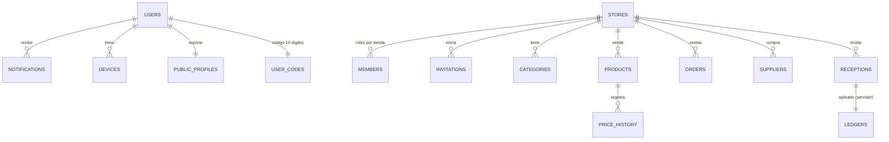

# 8. Modelo de datos (Firestore)

Los montos se guardan en **céntimos** (enteros) y ya incluyen IGV. Las cantidades admiten
decimales (kilos, litros). Las fechas son `Timestamp`. Los archivos se guardan como **ruta** de
Cloud Storage.



## Usuarios

| Ruta | Campos | Escribe |
|---|---|---|
| `users/{uid}` | `displayName`, `email`, `phone`, `photoPath`, `code`, `isSuperadmin`, `disabled`, `createdAt`, `updatedAt` | Función (creación); el usuario edita nombre, teléfono y foto |
| `users/{uid}/notifications/{id}` | `type` (`invitation`, `invitation_response`, `usage_alert`), `title`, `body`, `fromUid`, `fromName`, `fromPhotoPath`, `invitationId`, `invitationStatus`, `storeId`, `read`, `createdAt` | Funciones; el usuario marca `read` o borra |
| `users/{uid}/devices/{token}` | `token`, `platform`, `updatedAt` | La app (tokens FCM) |
| `publicProfiles/{uid}` | `displayName`, `displayNameLower`, `photoPath`, `code`, `disabled` | Función / usuario (nombre y foto) |
| `userCodes/{code}` | `uid` | Función (garantiza que el código sea único) |

## Tiendas

| Ruta | Campos |
|---|---|
| `stores/{storeId}` | `name`, `nameLower`, `address`, `photoPath`, `isPublic`, `currency` (ISO 4217, `PEN` por defecto), `ownerId`, `ownerName`, `disabledBySystem`, `createdAt`, `updatedAt` |
| `…/members/{uid}` | `uid`, `role` (`owner`, `employee`, `client`), `permissions[]`, `active`, `displayName`, `photoPath`, `code`, `joinedAt`, `updatedAt` |
| `…/invitations/{id}` | `storeId`, `storeName`, `storePhotoPath`, `fromUid`, `fromName`, `toUid`, `toName`, `toCode`, `role`, `status` (`pending`, `accepted`, `rejected`, `cancelled`), `createdAt`, `respondedAt` |

Permisos delegables (`permissions[]`): `view_stock`, `manage_products`, `manage_categories`,
`reports`, `stock_alerts`, `suppliers`, `receptions`, `members`, `edit_store`.

## Catálogo

| Ruta | Campos |
|---|---|
| `…/categories/{id}` | `name`, `nameLower`, `photoPath`, `createdAt`, `updatedAt` |
| `…/products/{id}` | `name`, `nameLower`, `categoryId`, `salePriceCents` (obligatorio), `purchaseCostCents`, `unit` (`unit`, `kg`, `g`, `l`, `ml`, `m`, `pack`, `box`, `dozen`), `stock` (`null` = ilimitado; puede ser negativo), `stockAlert`, `barcode`, `qrCode`, `photoPath`, `createdAt`, `updatedAt`, `updatedBy` |
| `…/products/{id}/priceHistory/{id}` | `salePriceCents`, `purchaseCostCents`, `source` (`created`, `manual`, `reception`), `refId`, `changedBy`, `changedByName`, `at` |

La categoría **"Todos"** es virtual (no se guarda).

## Ventas

`…/orders/{orderId}`

| Campo | Notas |
|---|---|
| `number` | `null` al crearla (también sin conexión). La función `onOrderCreated` asigna el correlativo de la tienda |
| `status` | `pending` → `confirmed` |
| `stockApplied` | `true` cuando el servidor ya descontó el stock (idempotencia) |
| `createdBy`, `createdByName`, `createdAt`, `syncedAt` | |
| `paymentMethod` | `cash`, `card`, `yape`, `plin`, `transfer`, `other` (informativo) |
| `currency`, `totalCents` | |
| `items[]` | `productId` (null en manuales), `description`, `categoryId`, `categoryName`, `quantity`, `unit`, `unitPriceCents`, `unitCostCents` (costo vigente al vender), `subtotalCents`, `manual` |

Contador del correlativo: `…/meta/counters.orderSeq` (solo servidor).

## Compras

| Ruta | Campos |
|---|---|
| `…/suppliers/{id}` | `companyName`, `ruc`, `phone`, `contactName`, `email`, `address`, `notes`, `updatedAt` (el proveedor "Otros" es virtual: id `otros`) |
| `…/receptions/{id}` | `supplierId`, `supplierName`, `lines[]` (`productId`, `productName`, `quantity`, `unit`, `unitCostCents`), `invoiceTotalCents`, `invoicePhotos[]` (máx. 10), `notes`, `receivedAt`, `createdBy`, `createdByName`, `createdAt`, `updatedAt`, `updatedBy`, `updatedByName` |
| `…/ledgers/{receptionId}` | `quantities{productId: qty}`, `costs{productId: cents}`: lo ya aplicado al stock (solo servidor) |

## Sistema

| Ruta | Uso |
|---|---|
| `system/usageAlerts` | Alertas de consumo ya enviadas por periodo (solo servidor) |

## Storage

```
users/{uid}/{uuid}.jpg                    avatar
stores/{storeId}/store/{uuid}.jpg         foto de la tienda
stores/{storeId}/categories/{uuid}.jpg    fotos de categorías
stores/{storeId}/products/{uuid}.jpg      fotos de productos
stores/{storeId}/receptions/{uuid}.jpg    facturas (imagen, PDF o Excel)
```
